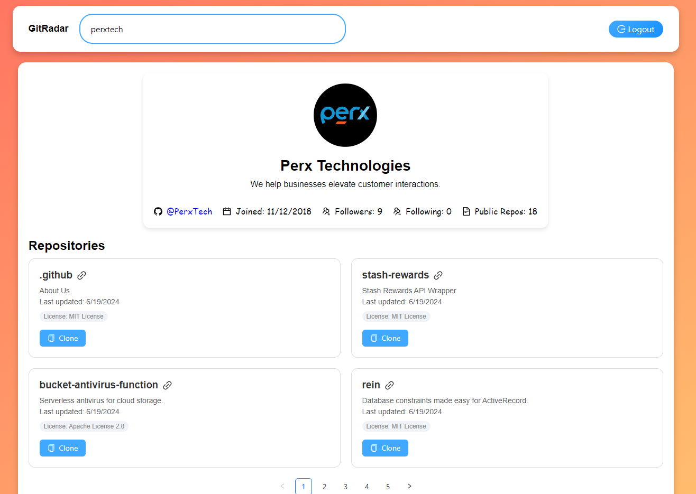

# Gitradar

### Demo

✨✨✨ Click the image below to see it in action! ✨✨✨

### 1. Introduction

GitRadar code repository is developed for the coding challenge of PerX Senior Software Engineer interview  

#### Technologies I used:
- React.js latest version (v19)
- Styled components & Ant Design
- Redux & Redux saga
- Back-end: I followed [tutorial](https://www.youtube.com/watch?v=rRn2EisxPl4) to handle authentication.
- Unit & Integration Test: Jest
- Deployment: Vercel
  
### 2. Getting Started with GitRadar
This project was bootstrapped with [Create React App](https://github.com/facebook/create-react-app).

In the project directory, you can run:

### `npm start`

Runs the app in the development mode.\
Open [http://localhost:3000](http://localhost:3000) to view it in your browser.

The page will reload when you make changes.\
You may also see any lint errors in the console.

### `npm test`

Launches the test runner in the interactive watch mode.\
See the section about [running tests](https://facebook.github.io/create-react-app/docs/running-tests) for more information.

### `npm run lint`

This command will scan the project's codebase and flag any issues related to code style, potential bugs, or deviations from the project's coding guidelines

### 1. Challenge description

Using the [Github API](https://developer.github.com/v3/), create a web application that retrieves and displays the user's repositories and
organizations that he/she belongs to in Github. And deploy the project somewhere
and host the source code on your Github profile. The application in a nutshell
would include an input to enter the username, a section to display the list of
repositories and another section that displays the organizations.

Please use Facebook's [create-react-app](https://create-react-app.dev/) as the
base.

#### Additional features
Implement *at least* **four** features from this list.

- Use only hooks and functional components
- Some sort of Unit Testing
- Some sort of Integration Testing
- Having a nice UI
- Adding a global state management (Redux, MobX, xstate, recoil etc)
